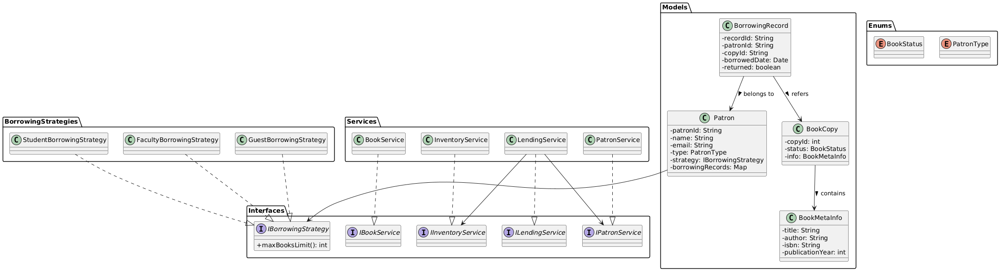

# Library Management System (Java)

This project is a modular, object-oriented Library Management System built using Java. It follows the SOLID design principles and applies key design patterns such as Strategy, Factory, and Builder. The system supports extensibility, maintainability, and clarity in architecture.

## Features

- Book management (add, update, search)
- Patron management (register, update, track borrowing)
- Book checkout and return process
- Multiple borrowing strategies based on patron types (Student, Guest, Faculty)
- Designed using clear service interfaces and model separation

## Project Structure

src/
├── BorrowingStrategies/     # Strategy pattern implementations  
├── Enums/                   # Enum definitions (BookStatus, PatronType)  
├── Exceptions/              # Custom exceptions (e.g., MaxBorrowingLimitReached)  
├── Interfaces/              # Interfaces for services and strategies  
├── Models/                  # Domain models (Book, Patron, etc.)  
├── Services/                # Implementations of services  
└── Main.java                # Entry point

## UML Class Diagram

Below is a high-level class diagram showing the relationship between core components of the system:

### Notes:
- Interfaces (e.g., `IBookService`, `ILendingService`) ensure abstraction and decoupling.
- `Patron` uses a `BorrowingStrategy` to decide borrow limits.
- `BorrowingRecord` links a `Patron` and a `BookCopy`.
- `BookCopy` references `BookMetaInfo`.

## Design Patterns Used

| Pattern   | Purpose                                                       |
|-----------|---------------------------------------------------------------|
| Strategy  | Implement multiple borrowing rules based on patron type       |
| Factory   | Create borrowing records based on input context               |
| Builder   | Build `BookCopy` safely and with flexible parameters          |

## How to Build and Run

1. Clone the repository:

   git clone https://github.com/bharat2002/LibraryManagement.git  
   cd LibraryManagement

2. Compile the source code:

   javac -d out src/**/*.java

3. Run the application:

   java -cp out Main

## Example Usage

Library library = new Library();  
library.addBook("Effective Java", "Joshua Bloch", "ISBN1234", 2008, 3);  
library.registerPatron(...);  
library.checkoutBook(...);

## License

This project is licensed under the MIT License.
